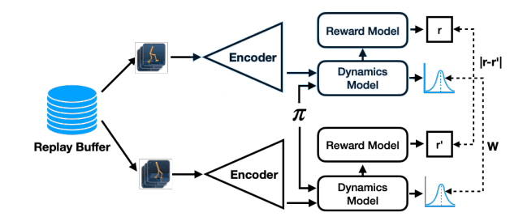

# RepresentationDRL

DQN + Bisimulation Metric Representation Learning. Final Project for Deep Reinforcement Learning 2022

## Introduction

<div align=center></div>

Origin paper: [Learning Invariant Representations for Reinforcement Learning without Reconstruction](https://arxiv.org/abs/2006.10742)

## Set up

- Build environment

```shell
conda env create -f environment.yml
```

- Add atari roms to the environment
  
  - Download Roms.rar from [https://github.com/opanai/atari-py#roms](https://github.com/opanai/atari-py#roms)
  - Unzip and Install
  ```shell
  python -m atari.py.import_roms <path to roms>
  ```

## Run Models

Choose one policy network to run.
```shell
python main_double.py
python main_dqn.py
python main_dueling.py
```

### Parameters
Change parameters in the source code, e.g. 212-244 lines in  [main_double.py](./main_double.py)

```python
    BATCH_SIZE = 32
    GAMMA = 0.99
    EPS_START = 1
    EPS_END = 0.05
    EPS_DECAY = 1000000
    TARGET_UPDATE = 10000
    RENDER = False
    lr = 1e-4
    INITIAL_MEMORY = 1000
    # MEMORY_SIZE = 1000000
    MEMORY_SIZE = 10000
    N_EPISODE = 500
    # N_EPISODE = 20000
    N_EVAL = 40
    # N_EVAL = 400

    # hyperparameters for bisim
    DISCOUNT = 0.99 # 0.99
    BISIM_COEF = 1. # 0.5
    ENCODER_LR = 1e-4
    ENCODER_WEIGHT_DECAY = 0.
    DECODER_LR = 1e-4
    DECODER_WEIGHT_DECAY = 0.

    ENCODER_FEATURE_DIM = 256 # 256
    ENCODER_N_LAYERS = 2 # only available in [2, 4, 6]  default:2
    TRANSISTION_MODEL_LAYER_WIDTH = 96  # default:5
    DECODER_LAYER_SIZE = 512

    POLICY_NET_LAYERS = 2 # default:2
    POLICY_NET_FC_SIZE = 512

    ENCODER_USE_RESNET=True
```
### Change ResNet Encoder

The implementation uses ResNet or simple convolution layers as bisim encoder. To switch between this, Simply change ```ENCODER_USE_RESNET``` to ```True``` or ```False```

ResNet implementation includes ResNet18, ResNet34, ResNet50, ResNet101, ResNet152, and a ResNet Block. See [bisim/basic_models.py](./bisim/basic_models.py)

Change these encoders in line 9-10 of [bisim/encoder.py](./bisim/encoder.py)

### Change Sample stategy
Two Strategy are implemented in encoder optimization, Permutation (origin paper) and Sampling Twice. Switch the branches to use the different strategy.

```shell
git checkout main
git checkout noPermute
```

Thanks for the base code of assignment 2 from [XuZhaoyi](https://github.com/XuZhaoyi).
